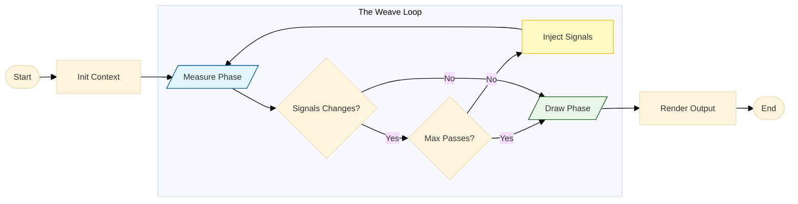

# The Mental Model

**Understanding the Weave Loop**

To use Loom effectively, you must unlearn one thing about Typst: **Linearity.**

In standard Typst, code executes from top to bottom. A function at the start of the document cannot know what happens at the end. This is why you can't easily print a "Total Page Count" on Page 1 without complex state hacks.

Loom changes this by introducing **Time Travel** (or more technically, a multi-pass feedback loop).

## The Weave Loop

Loom does not run your document once. It runs it in a loop, refining the data with each iteration until everything is stable. We call this the **Weave Loop**.

1.  **Pass 1 (Discovery):** Loom runs your code. Components emit signals (prices, page numbers, headings). Loom collects them but draws nothing.
2.  **Pass 2 (Reaction):** Loom runs your code again. This time, the signals from Pass 1 are injected into the global **Context**. Components can now read data from the "future" (or rather, the previous pass).
3.  **Pass 3 (Stabilization):** If the reaction caused _new_ changes (e.g., the Table of Contents grew, pushing content to a new page), Loom runs again.
4.  **Final Pass (Drawing):** Once the data stops changing (Convergence), Loom executes the final `draw` phase to produce the PDF.



This happens automatically. The `weave` function handles the complexity of the loop; you only need to define the logic for your components.

## The Lifecycle of a Motif

When `weave` processes a component (Motif), it guides it through specific stages. It is important to understand that **Children are processed IN BETWEEN these stages**.

### 1. Scope (Setup)

First, the `scope` function is called.

- **Input:** The current Context (`ctx`) from the parent.
- **Action:** You can modify the context (e.g., set a variable, add a theme).
- **Output:** A new Context.
- **Crucial Detail:** This _new_ context is what will be passed to your children.

_(The engine now pauses your component to calculate your Children and collect their signals using the scope you just provided.)_

### 2. Measure (Logic)

Once the children are done, the engine calls your `measure` function.

- **Input:** The Context (from step 1) AND the **Data collected from Children**.
- **Action:** You perform your logic (e.g., summing up prices, filtering items).
- **Output:** You return a tuple `(signal, view)`.
  - `signal` (public): Data sent **UP** to your parent.
  - `view` (private): Data kept **LOCALLY** for your own drawing.

### The Convergence Check (Optimization)

At this point, Loom checks if the data is stable.

:::info Smart Skipping
If the signals changed compared to the last pass, the engine **skips the Draw phase**. This saves performance by avoiding expensive layout calculations until the data has stabilized.
:::

- If the signals changed compared to the last pass, the document has **not converged**.
- If the signals are stable (or this is the final pass), the engine proceeds to Draw.

### 3. Draw (Visuals)

Finally, if we are in the render pass, the `draw` function is called.

- **Input:**
  - `ctx`: The Scope.
  - `signal`: The Signal you emitted.
  - `view`: The View data you calculated.
  - `body`: The **Rendered Content of your Children**.
- **Action:** You wrap the children in a visual element (e.g., `block`, `table`, `text`).
- **Output:** A standard Typst content element.

## Visualization: The "V" Shape

You can visualize the execution flow of a single component as a "V" shape, collecting data on the way up.

:::tip The "V" Shape

1.  **Down (Scope):** You prepare the Context.
2.  **...Children Execute...** (They use your Scope, run their own V-shapes, and return signals).
3.  **Up (Measure):** You receive their signals and calculate your own.
4.  **Out (Draw):** You wrap their finished content.
    :::

<center>
```mermaid
%%{init: {'theme': 'base', 'themeVariables': { 'fontSize': '13px'}, 'flowchart': {'rankSpacing': 40, 'nodeSpacing': 30, 'curve': 'basis'}}}%%
flowchart TD
    %% Styling
    classDef phase fill:#f9f9f9,stroke:#333,stroke-width:2px;
    classDef data fill:#e1f5fe,stroke:#0277bd,stroke-width:1px,stroke-dasharray: 5 5;

    subgraph Component ["Component Lifecycle"]
        direction TB
        Step1["1. SCOPE (Down)

PREPARE Context"]:::phase
Step3["3. MEASURE (Up)
CALCULATE Logic"]:::phase
Step4["4. DRAW (Out)
RENDER Content"]:::phase
end

    Children("2. CHILDREN EXECUTE

(Recursion)"):::phase

    %% Data Flow
    Step1 -->|"Context (ctx)"| Children
    Children -->|"Signals (public)"| Step3
    Step3 -->|"View (private)"| Step4

````
</center>

This architecture ensures that by the time you reach the `draw` function, you have **all** the information you need: context from above, and signals from below.

## Convergence & Stability

Loom is a "Fixed-Point Engine." This means it repeats the loop until the document **Converges** (stops changing).

### The `max-passes` Safety Valve

To prevent infinite loops (e.g., A changes B, B changes A), Loom has a hard limit.

- **Default:** 2 passes (sufficient for 90% of documents).
- **Configurable:** You can increase this in `weave(max-passes: 5)` if you have deep dependency chains.

### Handling Non-Convergence

Sometimes, complex logic might fail to settle within the allowed passes (e.g., an oscillating signal). Instead of failing silently or crashing, you can intercept this state.

The `weave` function accepts a `handle-nonconvergence` callback. This allows you to log warnings, inspect the conflicting data, or even force a fallback state.

```typ
#show: weave.with(
  max-passes: 5,
  handle-nonconvergence: (ctx, iterations, last-payload, current-payload) => {
    // Example: Warn the user if the document is unstable
    panic("Document did not converge after " + str(iterations) + " passes.")
    // You can also inspect 'last-payload' vs 'current-payload' to see what changed.
  }
)
````
